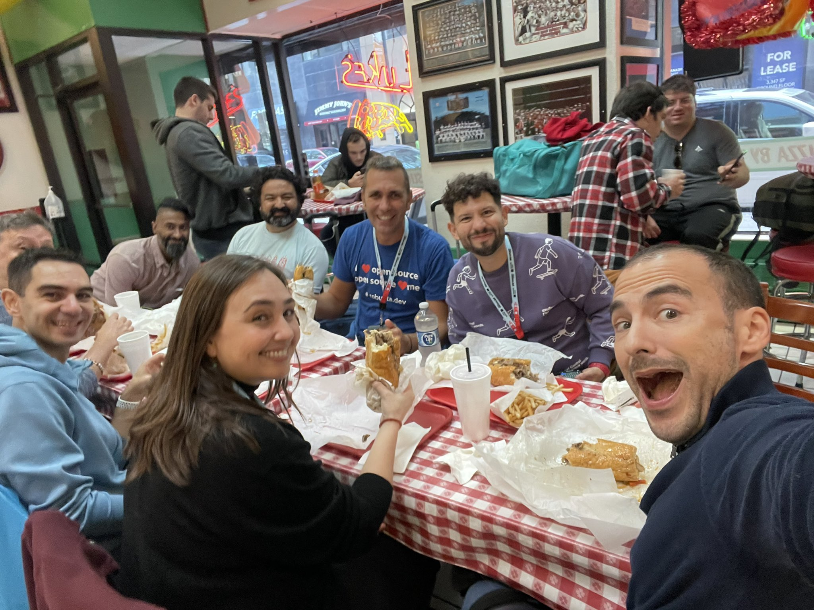

# CNCF SIG Foodies website

[Atlanta](./atlanta.md) | [Salt Lake City](./slc.md) | [Paris](./paris.md) | [Chicago](/) | [Amsterdam](./amsterdam.md)
=======

It's all started at Rejects 2023 in Chicago around noon at 
[Luke's Italian Beef](https://lukeschicago.com/)

Bunch of hungry foodies had their first Italian Beef Sandwich and it was decided that
CNCF needs a foodie SIG so we can all share our "research" for good local places and food to eat pre, during and after the event!

Here is how all started:

[Orlin Vasilev](https://twitter.com/OrlinVasilev)  
[Engin Diri](https://twitter.com/_ediri)  
[Cortney Nickerson](https://twitter.com/TechTalkingMom)  
[Ramiro Berrelleza](https://twitter.com/rberrelleza)  
[Marino Wijay](https://twitter.com/virtualized6ix)  
[Mauricio Salatino](https://twitter.com/salaboy)  
[Viktor Farcic](https://twitter.com/vfarcic)  
[Puja Abbassi](https://twitter.com/puja108)
[Luca Berton](https://lucaberton.com/)

# Purpose of the SIG
    To create a list of places, food, locations, varieties of food and drinks which can be used as a reference during your stay at KubeCon + CloudNativeCon SomewhereInTheWorld

## The Page is work in progress
