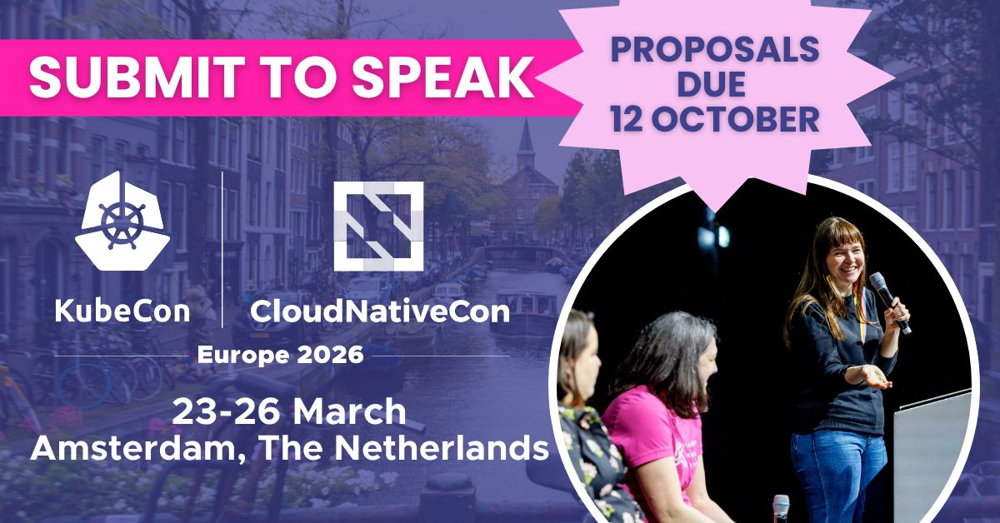

# Food Guide for KubeCon + Cloud Native Europe Amsterdam 2026 | 

## Dutch Classics & Local Flavours

### Must-try Dutch Specialties  
- [Stroopwafel](https://vanwonderen.co/) – warm, caramel-filled waffle (try Van Wonderen Stroopwafels)  
- [Bitterballen / Kroketten](https://www.iamsterdam.com/en/see-and-do/restaurant-and-bars/dutch-foods-to-try) – crisp deep-fried croquettes  
- [Haring / Hollandse Nieuwe](https://www.iamsterdam.com/en/see-and-do/restaurant-and-bars/best-herring-in-amsterdam) – raw herring with onion (street stalls)  
- [Kibbeling](https://www.iamsterdam.com/en/see-and-do/restaurant-and-bars/dutch-foods-to-try) – battered fried fish bites  
- [Poffertjes](https://www.iamsterdam.com/en/see-and-do/restaurant-and-bars/dutch-foods-to-try) – mini pancakes dusted with sugar  
- [Patat / Friet](https://www.vleminckxdesausmeester.nl/) – Dutch-style fries (try “patatje oorlog”)  
- [Roti / Indonesian / Surinamese dishes](https://www.iamsterdam.com/en/see-and-do/restaurant-and-bars/love-letter-to-the-roti-shops-of-amsterdam) – reflecting multicultural Amsterdam  

---

## Restaurants by Category

### Fine Dining / Elevated Experience
- [De Kas](https://restaurantdekas.com/) — greenhouse / farm-to-table
- [Wils](https://restaurantwils.nl/)
- [Breda](https://breda-amsterdam.nl/)
- [Sinne](https://restaurantsinne.nl/)
- [Vermeer](https://hotel-amsterdam.nl/vermeer-restaurant) — Michelin / upscale
- [The White Room by Jacob Jan Boerma](https://www.restaurantthewhiteroom.com/en/)

---

### Modern Classics & Local Favorites  
- [BAK](https://bakrestaurant.nl/)
- [Watergang](https://restaurantwatergang.nl/)
- [Troef](https://troefamsterdam.nl/)
- [Café-Restaurant Amsterdam](https://cradam.nl/)

---

### Casual / Ethnic & Neighborhood Spots  
- [Belly Pepper](https://www.instagram.com/belly.pepper/?hl=en) (Turkish / brunch)
- [Ikaria Park](https://www.ikariapark.nl/) (Greek small plates)
- [La Perla Pizzeria](https://pizzaperla.nl/) (Pizza in Jordaan)  
- [Lebanese Sajeria](https://thesajeria.com/)  
- [Salmuera Restaurant & Mezcaleria](https://www.sal-amsterdam.nl/)
- [nNea pizza](https://www.instagram.com/nnea_ams/?hl=en)

---

## Markets & Food Halls  
- [Foodhallen](https://foodhallen.nl/en/)  
- [Market 33](https://market33.nl/nl/) (Zuidas)  
- [Market 27](https://market27.nl/nl/) (Noord)  
- [Albert Cuyp Market](https://www.iamsterdam.com/en/whats-on/calendar/shopping/markets/albert-cuypmarkt)  
- [Ten Katemarkt](https://www.iamsterdam.com/en/whats-on/calendar/shopping/markets/ten-katemarkt)  
- [Noordermarkt (Sat)](https://www.iamsterdam.com/uit/agenda/winkelen/markten/noordermarkt)  

---

## Breakfast / Brunch & Cafés  
- [Gartine](https://www.gartine.nl/)  
- [Staring At Jacob](https://www.staringatjacob.nl/)  
- [Tom’s Bread & More](https://www.tomsbreadmore-amsterdam.nl/)
- [Café ’T Papeneiland](https://www.papeneiland.nl/)  

---

## Vegetarian / Plant-forward Picks  
- [Vegan Food Tour](https://www.iamsterdam.com/en/whats-on/calendar/attractions-and-sights/tours/vegan-food-tour)
- [Hearth](https://www.hearthamsterdam.com/)
- [BAK](https://bakrestaurant.nl/)
- [De Kas](https://restaurantdekas.com/)
- Vegan/vegetarian stalls in [Foodhallen](https://foodhallen.nl/en/), Market 27, etc.  

---

## Gluten-free
- [Gluten-free food](https://www.iamsterdam.com/en/see-and-do/restaurant-and-bars/gluten-free-food-in-amsterdam)
