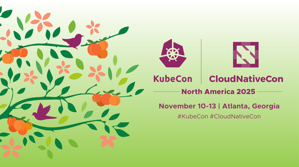

# Food guide for KubeCon + Cloud Native NA in Atlanta, GA 2025 | 

### Meats
- [Marcel](https://marcelatl.com/)
- [Kevin Rathbun Steak](https://www.kevinrathbunsteak.com/)
- [H & F Burger](https://hfburger.com/) - Great Burger Place
- [The Vortex](https://www.thevortexbar.com/food-menu)

### Local goodies
- [The Optimist](https://www.theoptimistrestaurant.com/atlanta) $$$

### Bakery - Boulangerie(breads and Baguettes baked on-premises)
- [Lee's bakery](https://leesbakeryatl.com/) - Vietnamese Bakery
- [Evergreen Butcher and Bakery](https://www.evergreenbutcherandbaker.com/) - Butcher shop and Bakery on the same place, great breads and pastries!

### Sushi and Asian
- [Hayakawa](https://www.hayakawaatl.com/) - Sushi
- [Pho Dai Loi 2](https://www.phodailoi.com/) - Vietnamese
- [SOKONGDONG tofu house](https://www.sokongdongtofuhouse.com/) - Korean
- [Lee's bakery](https://leesbakeryatl.com/) - Vietnamese Bakery

### Pizza
- [Little Italia](https://littleitalia.com/)

### Street food/Food Market
- [Ponce City Market](https://poncecitymarket.com/)
- [The Krog District](https://www.thekrogdistrict.com/)
- [Buford Highway Farmers Market](https://share.google/MI5RmG8xMoa0BDaGh) - Market with food and ingredients from all over the world

### Pastry Shop 

### Breakfast/Brunch

### Fine Dining
- [The Optimist](https://www.theoptimistrestaurant.com/atlanta) $$$

### Vegetarian

### Music
